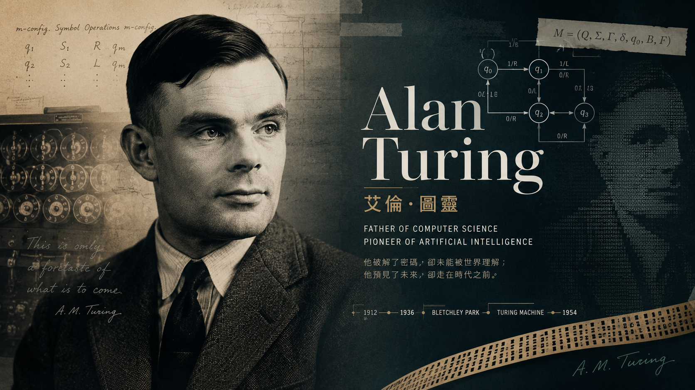

## 目录

- [前言：什么是 AI？](#前言什么是-ai)
- [一、 AI 是谁最早提出来的？](#一-ai-是谁最早提出来的)
- [二、 AI 到底是怎么工作的？](#二-ai-到底是怎么工作的)
- [三、 AI 的家族关系](#三-ai-的家族关系)
- [四、 AI 什么时候火起来的？](#四-ai-什么时候火起来的)
- [五、它能为我们做什么？](#五它能为我们做什么)
- [结语](#结语)

### 前言：什么是 AI？
简单来说，**AI（Artificial Intelligence，人工智能）就是让机器像人一样去“思考”、“学习”和“解决问题”的技术。** 过去是我们学习如何使用工具，而未来是工具主动学习如何配合我们。

---
### 一、 AI 是谁最早提出来的？

虽然人类幻想机器拥有智慧已经几个世纪了，但“人工智能”作为一门正式的学科，诞生于 **1956 年**。

1. **“人工智能之父”：约翰·麦卡锡（John McCarthy）**
	
  
    1956 年夏天，年轻的数学家麦卡锡召集了一群天才（包括后来的诺贝尔奖得主、图灵奖得主）在**达特茅斯学院**开了一个多月的会。在会议建议书中，他首次提出了 **“Artificial Intelligence”（人工智能）** 这个词。
    
    - 专业背景： 这次会议被称为“达特茅斯会议”，它标志着 AI 学科的正式诞生。
        
2. **“灵魂人物”：艾伦·图灵（Alan Turing）**  
   
    在麦卡锡提出术语的 6 年前（1950 年），计算机科学的鼻祖图灵就写了一篇伟大的论文《计算机器与智能》，开头第一句话就是：**“机器能思考吗？”** 他还设计了著名的**“图灵测试”**。
    
    - 通俗理解： 麦卡锡给 AI 起好了名字，而图灵给 AI 定好了目标。
---

### 二、 AI 到底是怎么工作的？

#### 1. 通俗理解：从“木头人”到“优秀学生”
*   **传统程序（木头人）：** 你必须给它下达死命令——*“如果遇到 A，就做 B”*。它没有灵活性，一旦遇到没教过的场景就会罢工。
*   **AI（进化中的学生）：** 你不需要教它每一条规则，而是给它看海量的数据。
    *   *例子：识别猫。* 传统程序需要你写代码定义“尖耳朵、胡须”；而 AI 则是看 100 万张猫的照片，自己总结出猫的特征。哪怕是只露出一半身子的猫，它也能一眼认出来。

#### 2. 专业定义：AI 的三大核心要素
在工业界，一个强大的 AI 必须依靠以下三个支撑：
*   **算法（Algorithm）—— 它的“大脑”：** 目前主流是神经网络，模仿人脑神经元的连接方式，通过复杂的数学模型寻找数据规律。
*   **算力（Computing Power）—— 它的“体力”：** AI 需要天文数字般的计算量，这依赖于高性能显卡（如 NVIDIA 的 GPU）。
*   **数据（Data）—— 它的“粮食”：** AI 通过大量文字、图片、视频进行训练。数据质量越高，AI 越聪明。

---

### 三、 AI 的家族关系

为了专业地理解 AI，我们需要理清它内部的层级关系：

1.  **人工智能 (AI)：** 最广泛的概念，目标是让机器展现智能。
2.  **机器学习 (Machine Learning)：** 实现 AI 的核心手段。让机器从数据中自动学习规律，而不是靠人工硬编码。
3.  **深度学习 (Deep Learning)：** 机器学习中最强大的一支。利用多层神经网络处理极其复杂的数据（如人脸识别、自动驾驶）。
4.  **生成式 AI (GenAI)：** 现在的“顶流”（如 ChatGPT）。它不仅能判断，还能**创造**新内容（写诗、画画、生成视频）。

---

### 四、 AI 什么时候火起来的？

AI 的发展经历了“三起两落”，我们正处于最疯狂的第三次浪潮中。

*   **第一波浪潮（1950s-1960s）：逻辑驱动**
    科学家试图用逻辑公式解决问题。但因当时计算能力太弱，AI 进入了第一次“寒冬”。
*   **第二波浪潮（1980s-1990s）：专家系统**
    通过模拟特定领域的专家知识（如辅助医生看病）风靡一时。但因系统太死板、维护成本高，进入第二次“寒冬”。
*   **第三波浪潮（2012年至今）：深度学习爆发**
    *   **2012年：** 辛顿（Geoffrey Hinton）证明了深度学习在图像识别上的碾压优势。
    *   **2016年：** AlphaGo 击败围棋冠军李世石，AI 彻底“出圈”，家喻户晓。
    *   **2022年底：** ChatGPT 发布，开启了从“感知”到“创造”的革命，标志着通用人工智能（AGI）雏形的出现。

---

### 五、它能为我们做什么？

目前的 AI 已经完成了三个阶段的进化：
1.  **感知层（看和听）：** 人脸识别、语音转文字、垃圾邮件过滤。
2.  **认知层（理解和思考）：** 翻译语言、分析财报、辅助医生诊断影像。
3.  **创造层（生成内容）：** 写小说、画插画、制作视频（如 Sora）、编写代码。

---

### 结语

**AI 不是一种具体的机器，而是一套让机器变聪明的“数学魔法”。** 

从 1956 年那个夏天的构想到如今 ChatGPT 的无所不知，AI 已经从实验室里的玩具进化成了像电能、互联网一样的基础设施。它不会取代人类，但那些**学会使用 AI 的人，将会取代那些拒绝 AI 的人。**
